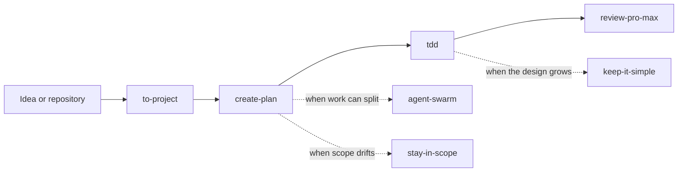

<div align="center">

# Srulik Toolkit

[](LICENSE)
[](https://claude.ai/code)
[](https://github.com/openai/codex)
[](https://github.com/tzachbon/srulik-toolkit/actions/workflows/validate.yml)

**Seven focused skills for planning and shipping software with Claude Code and Codex.**

[Install](#install) · [Choose a skill](#choose-a-skill) · [Contribute](CONTRIBUTING.md)

</div>

Srulik Toolkit packages the workflows I use to turn loose ideas into projects,
write plans, review changes, keep work in scope, delegate suitable tasks, work
test-first, and resist unnecessary code.

Each skill works on its own. Install one plugin, then invoke the skill you need
by name or describe the task in plain language.

## Install

### Claude Code

Run these commands in Claude Code:

```text
/plugin marketplace add tzachbon/srulik-toolkit
/plugin install srulik-toolkit@srulik-toolkit
```

Restart Claude Code after installation.

### Codex

```bash
codex plugin marketplace add tzachbon/srulik-toolkit
codex plugin add srulik-toolkit@srulik-toolkit
```

Start a new Codex task after installation.

## Choose a skill

| Skill | Use it when you want to |
| --- | --- |
| [`to-project`](plugins/srulik-toolkit/skills/to-project/SKILL.md) | Turn an idea or an existing folder into a project with durable context. |
| [`create-plan`](plugins/srulik-toolkit/skills/create-plan/SKILL.md) | Research and pressure-test a task, then write a detailed plan with concrete steps, rationale, requirement traceability, and verification. |
| [`review-pro-max`](plugins/srulik-toolkit/skills/review-pro-max/SKILL.md) | Review a local diff, branch, or pull request without changing it. |
| [`stay-in-scope`](plugins/srulik-toolkit/skills/stay-in-scope/SKILL.md) | Re-establish the requested boundary when work starts to drift. |
| [`agent-swarm`](plugins/srulik-toolkit/skills/agent-swarm/SKILL.md) | Split independent work across available child agents and verify the result. |
| [`tdd`](plugins/srulik-toolkit/skills/tdd/SKILL.md) | Build one behavior at a time through red, green, and refactor. |
| [`keep-it-simple`](plugins/srulik-toolkit/skills/keep-it-simple/SKILL.md) | Find the smallest correct change after understanding the affected flow. |

Example prompts:

```text
$create-plan Add offline support to this app
$review-pro-max Review the changes on my current branch
$tdd Implement expiration for cached sessions
$keep-it-simple Simplify this proposal before we build it
```

Claude Code may expose skills as slash commands. Codex uses `$skill-name`.
Plain-language requests can trigger a matching skill in either tool.

## How the toolkit fits together

Use only the skills that help with the current task. A common feature flow is:



`create-plan` checks installed skills before it looks for an external one. It
only searches when the plan has a material capability gap. It can suggest an
external skill, but it cannot install one without your approval.

## Optional tools

- `review-pro-max` can use GitHub CLI for pull requests. It can also run
  CodeRabbit when you opt in and the command is installed and authenticated.
  CodeRabbit may send source outside the local machine.
- `agent-swarm` uses the child-agent controls supplied by the active tool. It
  keeps eligible work serial when those controls are unavailable.
- `to-project` can search public skill catalogs when you ask. It requires your
  approval before installing another skill.

## Update or remove

### Claude Code

```text
/plugin marketplace update srulik-toolkit
/plugin update srulik-toolkit@srulik-toolkit

/plugin uninstall srulik-toolkit@srulik-toolkit
/plugin marketplace remove srulik-toolkit
```

### Codex

```bash
codex plugin marketplace upgrade srulik-toolkit

codex plugin remove srulik-toolkit@srulik-toolkit
codex plugin marketplace remove srulik-toolkit
```

## Local development

Clone the repository and run its checks:

```bash
git clone https://github.com/tzachbon/srulik-toolkit.git
cd srulik-toolkit
./scripts/validate.sh
```

Load the local Claude Code plugin with:

```bash
claude --plugin-dir ./plugins/srulik-toolkit
```

For Codex, register the checkout as a local marketplace:

```bash
codex plugin marketplace add .
codex plugin add srulik-toolkit@srulik-toolkit
```

The repository keeps the same skill payload for both tools:

```text
srulik-toolkit/
├── .agents/plugins/marketplace.json
├── .claude-plugin/marketplace.json
├── plugins/srulik-toolkit/
│   ├── .claude-plugin/plugin.json
│   ├── .codex-plugin/plugin.json
│   └── skills/
└── scripts/validate.sh
```

Read [CONTRIBUTING.md](CONTRIBUTING.md) before opening a pull request. Use the
[issue tracker](https://github.com/tzachbon/srulik-toolkit/issues) for bugs,
skill ideas, and questions. Report security concerns through
[SECURITY.md](SECURITY.md).

## License and notices

Srulik Toolkit is available under the [MIT License](LICENSE). [NOTICE.md](NOTICE.md)
records source and optional-tool notices.
